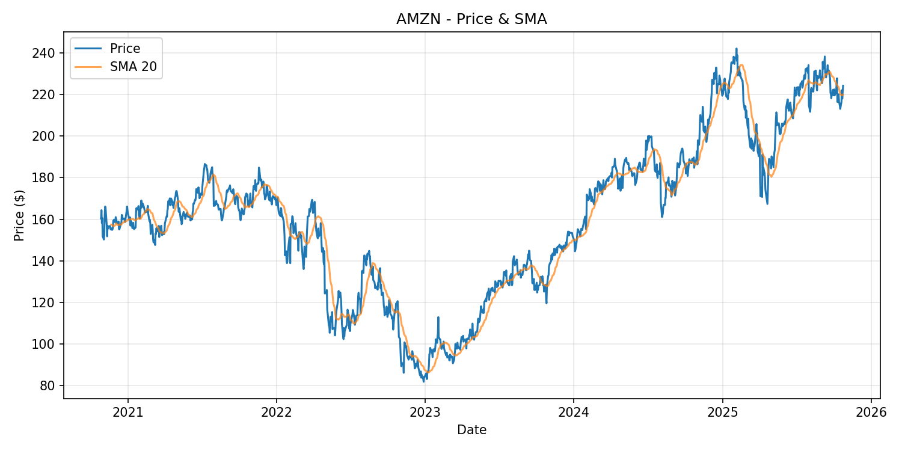

# stock analysis tool
### python • yfinance api • data visualization • technical analysis

a python-based stock market analysis tool.
it fetches financial data from yahoo finance, calculates technical indicators (daily returns and moving averages), generates charts, exports results, and summarizes key metrics.

for the complete walkthrough of the workflow and outputs, see ➡️ [`stock_analysis.ipynb`](./stock_analysis.ipynb)

## 📁 repository structure
```
stock-analysis-tool/
├── stock_analysis.ipynb        # notebook walkthrough
├── stock_analysis.py           # core python module
├── requirements.txt            # python dependencies
├── README.md                   # project overview (this file)
├── .gitignore                  # git ignore rules
├── LICENSE                     # mit license
├── examples/                   # example outputs
│   └── AMZN_price_sma.png
└── stock_data/                 # generated data (gitignored)
    ├── AMZN.csv
    └── AMZN_price_sma.png
```

## quick start
### installation
1. **clone the repository**
```bash
git clone https://github.com/moniburnejko/stock-analysis-tool.git
cd stock-analysis-tool
```
3. **install dependencies**
```bash
pip install -r requirements.txt
```
3. **run the notebook**
```bash
jupyter notebook stock_analysis.ipynb
```
4. **or run the script**
```bash
python stock_analysis.py
```
    
### example workflows
**example 1 - analyze amazon with default parameters**
```python
from stock_analysis import Config, run_analysis

cfg = Config()  # default: ticker = 'AMZN', period = '5y', interval = '1d', sma_window = 20, our_dir = Path('stock_data'), show_plots = True
df, stats = run_analysis(cfg)
```
**example 2 - change ticker and period**
```python
df, stats = run_analysis(Config(ticker='AAPL', period='2y'))
```
**example 3 - weekly analysis with longer sma**
```python
cfg = Config(
    ticker='TSLA',
    period='max',
    interval='1wk',
    sma_window=100,
    show_plots=True
)
df, stats = run_analysis(cfg)
```
**example 4 - multi-stock analysis**
```python
tickers = ['ORCL', 'NVDA', 'MSFT', 'IBM']

for ticker in tickers:
    cfg = Config(ticker=ticker, period='2y', sma_window=50)
    df, stats = run_analysis(cfg)
```

## output examples
### generated statistics
|                    | Value       |
|------------------------|-------------|
| Rows                   | 1256.0      |
| Start Date             | 2020-10-26  |
| End Date               | 2025-10-24  |
| Start Price            | 160.35      |
| End Price              | 224.21      |
| Total Return (%)       | 39.82       |
| Daily Return Mean (%)  | 0.05        |
| Daily Return Std (%)   | 2.21        |
| Min Price              | 81.82       |
| Max Price              | 242.06      |
### sample visualization
*price chart with 20-day simple moving average overlay*


## technologies
- **python 3.13+** - core programming language
- **pandas** - data manipulation and analysis
- **yfinance** - yahoo finance api wrapper
- **matplotlib** - data visualization
- **jupyter notebook** - interactive development environment

## advanced features
### available functions
- `fetch_prices()` - download historical stock data
- `add_metrics()` - calculate technical indicators
- `save_csv()` - export data to csv
- `plot_price_sma()` - generate price charts
- `summarize()` - compute statistical summary
- `run_analysis()` - complete analysis pipeline

### error handling
the tool includes robust error handling for:
- invalid ticker symbols
- network failures
- missing data
- empty datasets

```python
try:
    cfg = Config(ticker='INVALID')
    df, stats = run_analysis(cfg)
except RuntimeError as e:
    print(f"Analysis failed: {e}")
```

## api reference
### config class
```python
@dataclass
class Config:
    """configuration for stock analysis parameters"""
    ticker: str = 'AMZN'
    period: str = '5y'
    interval: str = '1d'
    sma_window: int = 20
    out_dir: Path = Path('stock_data')
    show_plots: bool = True
```
### core functions
```python
def fetch_prices(ticker: str, period: str, interval: str) -> pd.DataFrame:
    """fetch historical stock prices from yahoo finance"""
    
def add_metrics(df: pd.DataFrame, sma_window: int) -> pd.DataFrame:
    """add technical indicators (sma, returns) to dataframe"""
    
def run_analysis(cfg: Config) -> tuple[pd.DataFrame, pd.DataFrame]:
    """execute complete analysis workflow"""
```

## acknowledgments
- data provided by [yahoo finance](https://finance.yahoo.com/)
- built with [yfinance](https://github.com/ranaroussi/yfinance) library
- inspired by my assignment from the ibm data analyst professional certificate program. it has been significantly extended, refactored, and automated to serve as a fully functional and reproducible portfolio project

## license
this project is released under the **mit license**.  

## connect
👩‍💻 **Monika Burnejko**  
*data analyst in training | python • pandas • yfinance • data viz*
<br>📧 [moniburnejko@gmail.com](mailto:moniburnejko@gmail.com)  
💼 [linkedin](https://www.linkedin.com/in/monika-burnejko-9301a1357)  
🌐 [portfolio](https://www.notion.so/monikaburnejko/Data-Analytics-Portfolio-2761bac67ca9807298aee038976f0085?pvs=9)

---
<p align="center">
🌟 if you found this project helpful, please consider giving it a star! 🌟
</p>
